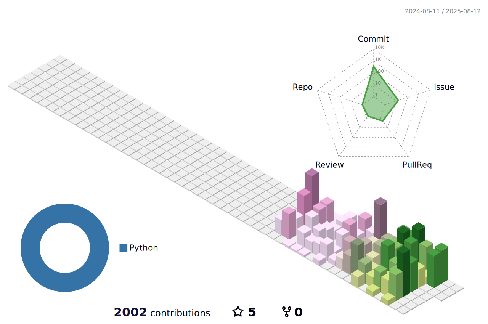

# 📊 3D Contribution Graph

Here's a 3D visualization of my GitHub contributions. This interactive graph shows my coding activity over time in a fun, three-dimensional format!

## My 3D Contribution Graph

## What does this show?
This 3D graph visualizes my GitHub contributions with:
- Height representing the number of contributions
- Colors indicating different days of the week
- A rotating animation to view from all angles

## How is it generated?
This visualization is created using GitHub's contribution data and rendered with 3D graphics. It updates automatically as I make new contributions to my repositories.

[⬅️ Back to main README](README.md)
