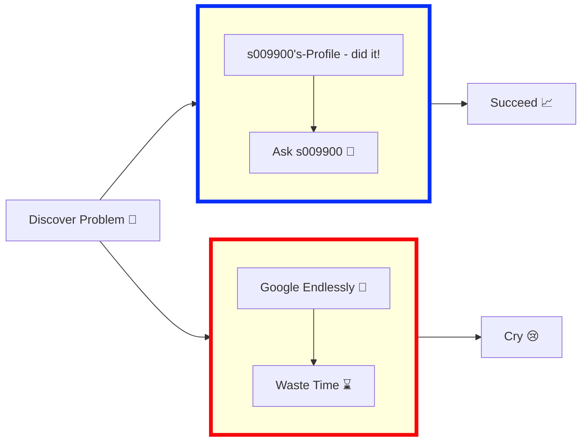

<!-- Animated Header -->

  

<!-- Guestbook -->
<!--
## 📝 Guestbook

Leave your mark in my guestbook! Share a message, a joke, or just say hi. I'd love to hear from you! 😊

[Sign the Guestbook](https://github.com/s009900/s009900/issues/new?template=guestbook.yml&title=Guestbook%3A+Your+Name) ➠•  [View All Entries](https://github.com/s009900/s009900/issues?q=is%3Aissue+label%3Aguestbook+sort%3Acreated-desc)

### Recent Guestbook Entries

| Emoji | Name | Message | Date |
|:-----:|:----:|:-------:|:----:|
| 🎉 | You | Be the first to sign my guestbook! | Today |

*Sign the guestbook to see your message here!*
-->

#  s009900
# 
 
 

### Contributions Snake Light/Dark Themed

## <b> Languages and Tools</b>

<table align="center">
  <tr>
    <td align="center" width="96">
        
       React
    </td>
    <td align="center" width="96">
        
       C#
    </td>
    <td align="center" width="96"> 
        
    s   .Net
    </td>
    <td align="center" width="96">
        
       C++
    </td>
    <td align="center" width="96">
        
       JavaScript
    </td>
     <td align="center" width="96">
      
       Python
    </td>
    <td align="center" width="96">
        
       MySQL
    </td>
  </tr>
  <tr>
  <td align="center" width="96">
        
       Django
    <td align="center" width="96">
        
       Github
    </td>
    <td align="center"  width="96">
        
       HTML5
    </td>
    <td align="center" width="96">
        
       CSS
    </td>
    <td align="center"  width="96">
        
       Bootstrap
    </td>
      <td align="center" width="96">
        
       SQL
    </td>
        <td align="center" width="96">
        
       Nodejs
      </td>
      </td>
   
  
 </tr>
</table>
  
</tr>
</tr></tr>

## 📊 GitHub Statistics

Check out my detailed [GitHub Statistics](stats.readme.md) page for an in-depth look at my coding activity, including contribution patterns, language distribution, and more!

## 👥 Followers

Check out my [followers page](followers.readme.md) to see who's following my work. Feel free to follow me too!

## 🏆 Trophies

Check out my [GitHub Trophies](trophies.readme.md) to see my achievements and milestones!

## 📊 3D Contribution Graph

Check out my [3D Contribution Graph](3d-contributions.readme.md) for an interactive visualization of my GitHub activity!

<b>😁 Code Cycle</b>

<table style="border: none; border-collapse: collapse; margin: 10px 0;">
  <tr style="border: none;">
    <td align="center" style="border: none; padding: 0 20px;">
       
      Something BROKE!
    </td>
    <td align="center" style="border: none; padding: 0 20px;">
       
      It's FINALLY working...
    </td>
    <td align="center" style="border: none; padding: 0 20px;">
       
      on its own? HOW IS IT WORKING???
    </td>
  </tr>
</table>

<b>⛽ Metrics</b>

<b>🔄 Workflow Through Life</b>

<b>😋 Contributions</b>

Want to contribute? Awesome! 
  
The most basic way to show your support is to **star the project**. Thanks! 

<b>🫱🏼‍🫲🏼 Contributors - You can be one too! Just fork and submit a PR with your changes</b>

  

<b>⭐ Star History Chart</b>

#### Remember to  if you like this repo!

  <picture></picture>
  <picture></picture>
  <picture></picture>
  <picture></picture>
  <picture></picture>
  <picture></picture>

## 📊 Word Cloud

Check out my [Word Cloud](wordcloud.readme.md) to see a visual representation of my GitHub activity! You can also [add a word to the cloud](https://github.com/s009900/s009900/issues/new?template=word-cloud-submission.yml&title=Add+word+to+word+cloud). (Note: Emojis don't work yet)

  

