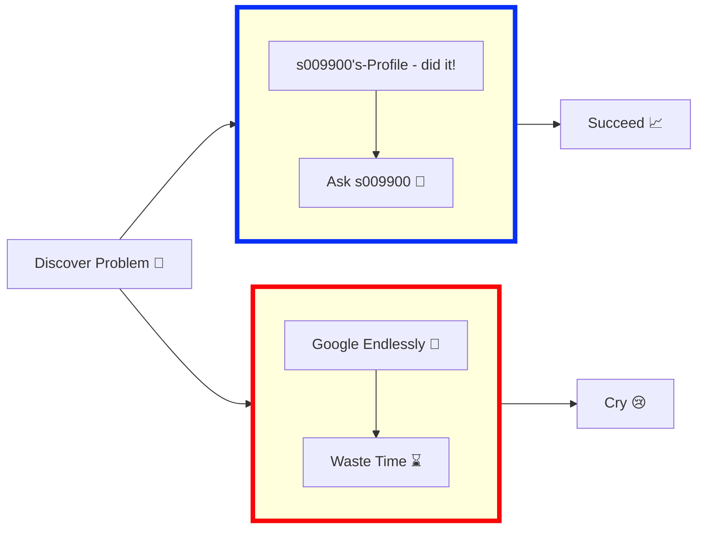

  <h1>s009900</h1>
  
  
  
  
  

    
    
  

### Contributions Snake Light/Dark Themed

## 🛠️ Technologies & Tools

### Programming Languages

  
  
  
  
  
  

### Databases & Frameworks

  
  
  
  
  

### Frontend & Design

  
  
  
  
  

### DevOps & Tools

  
  
  
  
  

<!-- start statics fun section -->

<b>📊 Cool Stats, Click to Expand</b>

### 📈 GitHub Statistics

 
 

### 🔥 Streak & Activity

 

### ⏰ Productivity & Contribution Patterns

 
 

### 💻 Language Distribution

 
 

### 📊 Contribution Graph

 

<!-- end statics fun section -->

<b>👥 Last Followers</b>

<!-- followers:start -->
| # | Avatar | Username |
|--:|:------:|:---------|
| 1 |  | [jaiq123](https://github.com/jaiq123) |
| 2 |  | [h0011000](https://github.com/h0011000) |
| 3 |  | [ez0000001000000](https://github.com/ez0000001000000) |
| 4 |  | [as000010000](https://github.com/as000010000) |

[View all followers](https://github.com/s009900?tab=followers)
<!-- followers:end -->
##### 👆 You can be here too! Go [here](https://github.com/s009900) and follow me. Updates every 1/2 hour.

  

<b>🏆 Trophies</b>

<b>👌 3D Graph and Charts</b>

<b>😁 Code Cycle</b>

<table style="border: none; border-collapse: collapse; margin: 10px 0;">
  <tr style="border: none;">
    <td align="center" style="border: none; padding: 0 20px;">
       
      Something BROKE!
    </td>
    <td align="center" style="border: none; padding: 0 20px;">
       
      It's FINALLY working...
    </td>
    <td align="center" style="border: none; padding: 0 20px;">
       
      on its own? HOW IS IT WORKING???
    </td>
  </tr>
</table>

<b>Metrics</b>

<b>🔄 Workflow Through Life</b>

<b>😋 Contributions</b>

Want to contribute? Awesome! 
  
The most basic way to show your support is to **star the project**. Thanks! 

<b>🫱🏼‍🫲🏼 Contributors - You can be one too! Just fork and submit a PR with your changes</b>

  

<b>⭐ Star History Chart</b>

  <picture></picture>
  <picture></picture>
  <picture></picture>
  <picture></picture>
  <picture></picture>
  <picture></picture>

## 🎨 Community Word Cloud

Add a word to my word cloud! (PS: Emojis don't work yet) [Click here to add your word](https://github.com/s009900/s009900/issues/new?template=word-cloud-submission.yml&title=Add+word+to+word+cloud)

<b>🔽 Click to Show/Hide Word Cloud</b>

##### Give it like 5 minutes to update, then reload the page after adding a word

  

  

