# s009900's profile readme

<!--## Guestbook-->
<!-- GUESTBOOK_START -->

<!-- GUESTBOOK_END -->
 

<!-- start statics fun section -->

<b> Cool Stats, Click to Expand </b>

  

<!-- end statics fun section -->

### Contributions Snake (Dark is not very good)

<b>📊 Activity Graph (Click to Expand)</b>

  

<b>👥 Last Followers (Click to Expand)</b>

| # | Avatar | Username |
|---|--------|----------|
| 1 |  | [as000010000](https://github.com/as000010000) |
| 2 |  | [ez0000001000000](https://github.com/ez0000001000000) |
| 3 |  | [h0011000](https://github.com/h0011000) |
| 4 |  | [jaiq123](https://github.com/jaiq123) |

## <b> Languages and Tools</b>

<table align="center">
  <tr>
    <td align="center" width="96">
        
       React
    </td>
    <td align="center" width="96">
        
       C#
    </td>
    <td align="center" width="96"> 
        
    s   .Net
    </td>
    <td align="center" width="96">
        
       C++
    </td>
    <td align="center" width="96">
        
       JavaScript
    </td>
     <td align="center" width="96">
      
       Python
    </td>
    <td align="center" width="96">
        
       MySQL
    </td>
  </tr>
  <tr>
  <td align="center" width="96">
        
       Django
    <td align="center" width="96">
        
       Github
    </td>
    <td align="center"  width="96">
        
       HTML5
    </td>
    <td align="center" width="96">
        
       CSS
    </td>
    <td align="center"  width="96">
        
       Bootstrap
    </td>
      <td align="center" width="96">
        
       SQL
    </td>
        <td align="center" width="96">
        
       Nodejs
      </td>
      </td>
   
  
 </tr>
</table>
  
</tr>
</tr></tr>

### Trophies

### Code Cycle 

&nbsp;&nbsp;&nbsp;&nbsp;&nbsp;
Something BROKE!

&nbsp;&nbsp;&nbsp;&nbsp;&nbsp;
It's FINALLY working...
 
&nbsp;&nbsp;&nbsp;&nbsp;&nbsp;
on its own? HOW IS IT WORKING???

```mermaid
flowchart LR
    %% Set the overall direction
    direction LR

    %% Subgraph 1
    subgraph S1 [ ]
        direction TB
        top1["s009900's-Profile - did it!"] --> bottom1["Ask s009900 🤝"]
    end

    %% Subgraph 2
    subgraph S2 [ ]
        direction TB
        top2["Google Endlessly 🔎"] --> bottom2["Waste Time ⌛"]
    end

    %% Entry point
    D["Discover Problem 🐛"] --> S1
    D --> S2

    S1 --> SC["Succeed 📈"]
    S2 --> CRY["Cry 😢"]

    click top1 "https://www.github.com/s009900/" "Visit Github Profile"
    style S1 stroke:#072ff7,stroke-width:5px
    style S2 stroke:#f70707,stroke-width:5px
```

  

<b>🔄 Workflow Through Life (Click to Expand)</b>

  <picture></picture>
  <picture></picture>
  <picture></picture>
  <picture></picture>
  <picture></picture>
  <picture></picture>
  <picture></picture>
  <picture></picture>
  <picture></picture>

  

