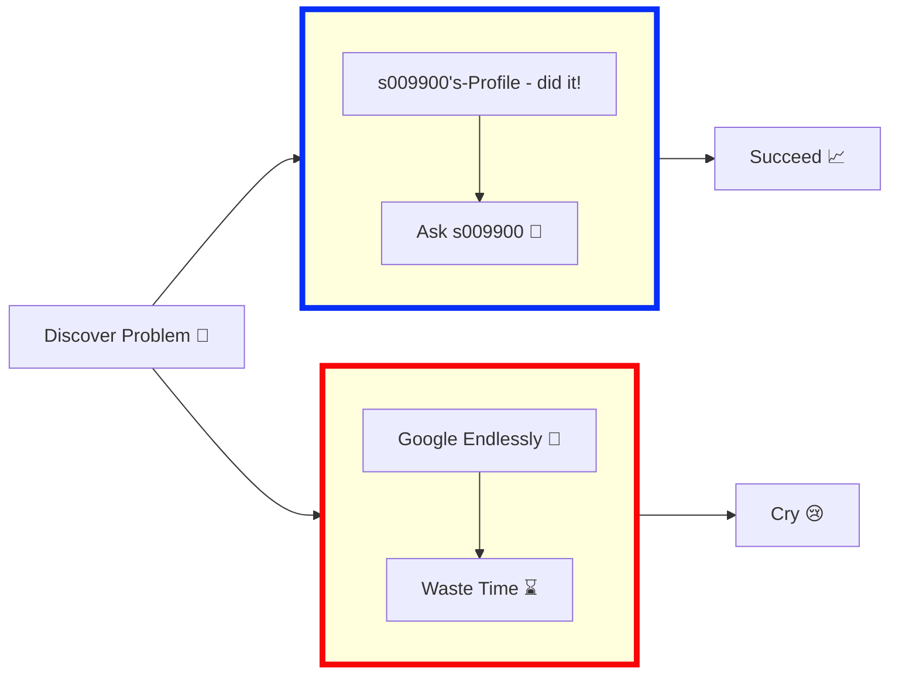

# 🔄 My Development Workflow

Here's a fun visualization of my typical problem-solving process as a developer. It's a journey of discovery, frustration, and occasional triumph!

## Problem-Solving Flowchart

## What This Represents
- **The Developer's Dilemma**: Two paths to solve every problem
- **The Right Way**: Asking for help and collaborating
- **The Hard Way**: Endless Googling and trial & error
- **The Inevitable**: Success or tears (sometimes both!)

## My Approach
I believe in the power of:
1. **Collaboration**: Leveraging community knowledge
2. **Persistence**: Pushing through challenges
3. **Learning**: Every bug is an opportunity to grow

[⬅️ Back to main README](README.md)
