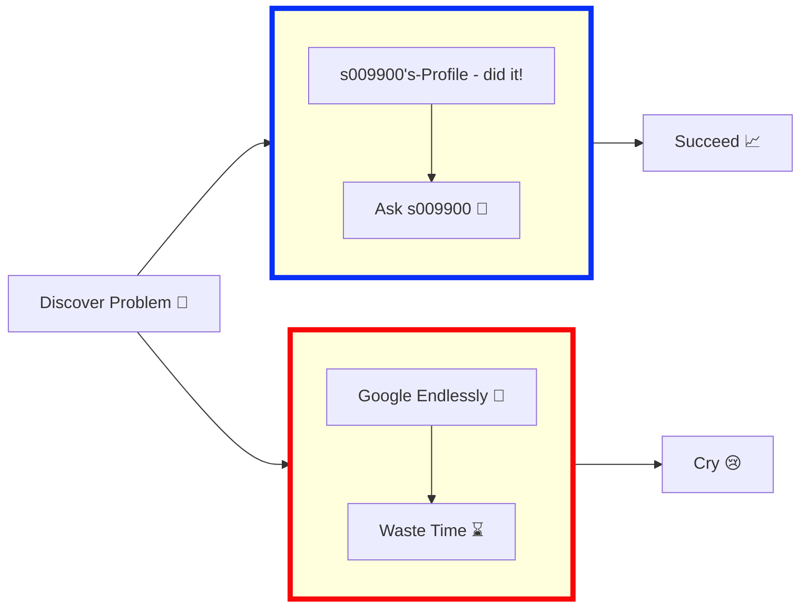

# 🔄 My Development Workflow

## Problem-Solving Flowchart

```mermaid
flowchart LR
    %% Set the overall direction
    direction LR

    %% Subgraph 1
    subgraph S1 [ ]
        direction TB
        top1["s009900's-Profile - did it!"] --> bottom1["Ask s009900 🤝"]
    end

    %% Subgraph 2
    subgraph S2 [ ]
        direction TB
        top2["Google Endlessly 🔎"] --> bottom2["Waste Time ⌛"]
    end

    %% Entry point
    D["Discover Problem 🐛"] --> S1
    D --> S2

    S1 --> SC["Succeed 📈"]
    S2 --> CRY["Cry 😢"]

    click top1 "https://www.github.com/s009900/" "Visit GitHub Profile"
    style S1 stroke:#072ff7,stroke-width:5px
    style S2 stroke:#f70707,stroke-width:5px
```

[⬅️ Back to main README](README.md)
